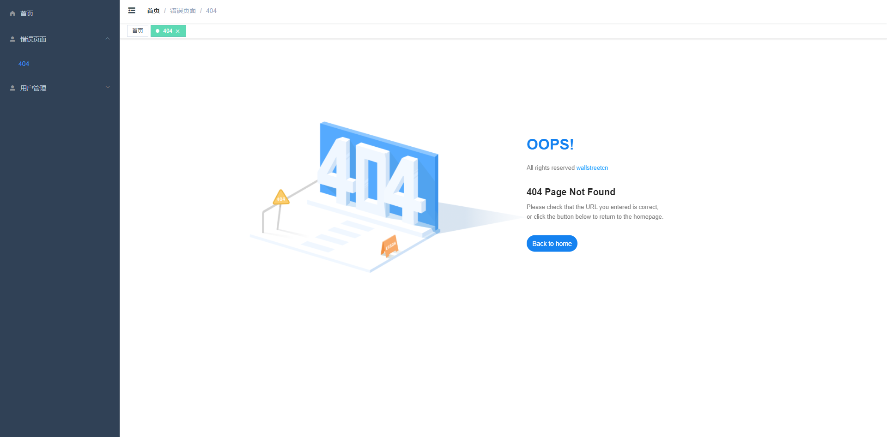

# manager-admin
基于 vue-cli4.5 + vue 3.0 + vue-router 4.0 + vuex 4.0 + element-plus + typescript 的后台管理系统 manager-admin
此系统页面风格仿照 element-admin 开发，系统还不完善，有待继续开发

页面展示



## Project setup
```
npm install
```

### Compiles and hot-reloads for development
```
npm run serve
```

### Compiles and minifies for production
```
npm run build
```

### Run your unit tests
```
npm run test:unit
```

### Lints and fixes files
```
npm run lint
```

### The online preview address
在线预览地址
> https://ljh95224.github.io/manager-admin

### Customize configuration
See [Configuration Reference](https://cli.vuejs.org/config/).
